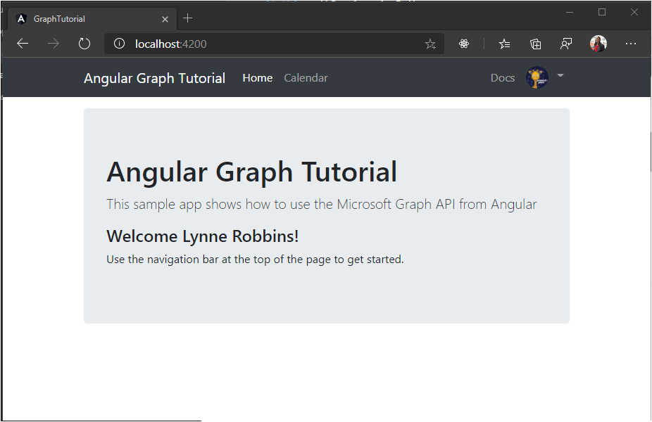
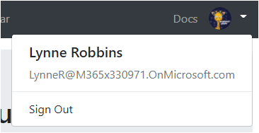

<!-- markdownlint-disable MD002 MD041 -->

In this exercise you will extend the application from the previous exercise to support authentication with Azure AD. This is required to obtain the necessary OAuth access token to call the Microsoft Graph. In this step you will integrate the [Microsoft Authentication Library for Angular](https://github.com/AzureAD/microsoft-authentication-library-for-js/blob/dev/lib/msal-angular/README.md) into the application.

1. Create a new file in the **./src** directory named **oauth.ts** and add the following code.

    :::code language="typescript" source="../demo/graph-tutorial/src/oauth.example.ts":::

    Replace `YOUR_APP_ID_HERE` with the application ID from the Application Registration Portal.

    > [!IMPORTANT]
    > If you're using source control such as git, now would be a good time to exclude the **oauth.ts** file from source control to avoid inadvertently leaking your app ID.

1. Open **./src/app/app.module.ts** and add the following `import` statements to the top of the file.

    ```typescript
    import { MsalModule } from '@azure/msal-angular';
    import { OAuthSettings } from '../oauth';
    ```

1. Add the `MsalModule` to the `imports` array inside the `@NgModule` declaration, and initialize it with the app ID.

    :::code language="typescript" source="../demo/graph-tutorial/src/app/app.module.ts" id="imports" highlight="6-11":::

## Implement sign-in

In this section you'll create an authentication service and implement sign-in and sign-out.

1. Run the following command in your CLI.

    ```Shell
    ng generate service auth
    ```

    By creating a service for this, you can easily inject it into any components that need access to authentication methods.

1. Once the command finishes, open **./src/app/auth.service.ts** and replace its contents with the following code.

    ```typescript
    import { Injectable } from '@angular/core';
    import { MsalService } from '@azure/msal-angular';

    import { AlertsService } from './alerts.service';
    import { OAuthSettings } from '../oauth';
    import { User } from './user';

    @Injectable({
      providedIn: 'root'
    })

    export class AuthService {
      public authenticated: boolean;
      public user: User;

      constructor(
        private msalService: MsalService,
        private alertsService: AlertsService) {

        this.authenticated = false;
        this.user = null;
      }

      // Prompt the user to sign in and
      // grant consent to the requested permission scopes
      async signIn(): Promise<void> {
        let result = await this.msalService.loginPopup(OAuthSettings)
          .catch((reason) => {
            this.alertsService.addError('Login failed', JSON.stringify(reason, null, 2));
          });

        if (result) {
          this.authenticated = true;
          // Temporary placeholder
          this.user = new User();
          this.user.displayName = 'Adele Vance';
          this.user.email = 'AdeleV@contoso.com';
          this.user.avatar = '/assets/no-profile-photo.png';
        }
      }

      // Sign out
      signOut(): void {
        this.msalService.logout();
        this.user = null;
        this.authenticated = false;
      }

      // Silently request an access token
      async getAccessToken(): Promise<string> {
        let result = await this.msalService.acquireTokenSilent(OAuthSettings)
          .catch((reason) => {
            this.alertsService.addError('Get token failed', JSON.stringify(reason, null, 2));
          });

        if (result) {
          // Temporary to display token in an error box
          this.alertsService.addSuccess('Token acquired', result.accessToken);
          return result.accessToken;
        }

        // Couldn't get a token
        this.authenticated = false;
        return null;
      }
    }
    ```

1. Open **./src/app/nav-bar/nav-bar.component.ts** and replace its contents with the following.

    :::code language="typescript" source="../demo/graph-tutorial/src/app/nav-bar/nav-bar.component.ts" id="navBarSnippet" highlight="3,15-22,24,26-28,36-38,40-42":::

1. Open **./src/app/home/home.component.ts** and replace its contents with the following.

    :::code language="typescript" source="snippets/snippets.ts" id="homeSnippet" highlight="3,12-19,21,23,25-32":::

Save your changes and refresh the browser. Click the **Click here to sign in** button and you should be redirected to `https://login.microsoftonline.com`. Login with your Microsoft account and consent to the requested permissions. The app page should refresh, showing the token.

### Get user details

Right now the authentication service sets constant values for the user's display name and email address. Now that you have an access token, you can get user details from Microsoft Graph so those values correspond to the current user.

1. Open **./src/app/auth.service.ts** and add the following `import` statements to the top of the file.

    ```typescript
    import { Client } from '@microsoft/microsoft-graph-client';
    import * as MicrosoftGraph from '@microsoft/microsoft-graph-types';
    ```

1. Add a new function to the `AuthService` class called `getUser`.

    :::code language="typescript" source="../demo/graph-tutorial/src/app/auth.service.ts" id="getUserSnippet":::

1. Locate and remove the following code in the `getAccessToken` method that adds an alert to display the access token.

    ```typescript
    // Temporary to display token in an error box
    this.alertsService.addSuccess('Token acquired', result);
    ```

1. Locate and remove the following code from the `signIn` method.

    ```typescript
    // Temporary placeholder
    this.user = new User();
    this.user.displayName = "Adele Vance";
    this.user.email = "AdeleV@contoso.com";
    this.user.avatar = '/assets/no-profile-photo.png';
    ```

1. In its place, add the following code.

    ```typescript
    this.user = await this.getUser();
    ```

    This new code uses the Microsoft Graph SDK to get the user's details, then creates a `User` object using values returned by the API call.

1. Change the `constructor` for the `AuthService` class to check if the user is already logged in and load their details if so. Replace the existing `constructor` with the following.

    :::code language="typescript" source="../demo/graph-tutorial/src/app/auth.service.ts" id="constructorSnippet" highlight="5-6":::

1. Remove the temporary code from the `HomeComponent` class. Open **./src/app/home/home.component.ts** and replace the existing `signIn` function with the following.

    :::code language="typescript" source="../demo/graph-tutorial/src/app/home/home.component.ts" id="signInSnippet":::

Now if you save your changes and start the app, after sign-in you should end up back on the home page, but the UI should change to indicate that you are signed-in.



Click the user avatar in the top right corner to access the **Sign Out** link. Clicking **Sign Out** resets the session and returns you to the home page.



## Storing and refreshing tokens

At this point your application has an access token, which is sent in the `Authorization` header of API calls. This is the token that allows the app to access the Microsoft Graph on the user's behalf.

However, this token is short-lived. The token expires an hour after it is issued. Because the app is using the MSAL library, you do not have to implement any token storage or refresh logic. The `MsalService` caches the token in the browser storage. The `acquireTokenSilent` method first checks the cached token, and if it is not expired, it returns it. If it is expired, it makes a silent request to obtain a new one.
