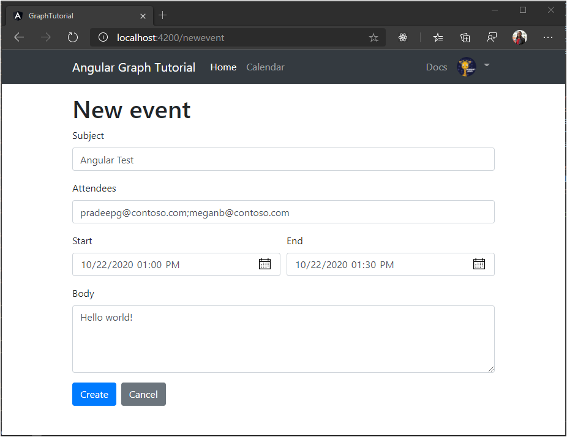

<!-- markdownlint-disable MD002 MD041 -->

In this section you will add the ability to create events on the user's calendar.

1. Open **./src/app/graph.service.ts** and add the following function to the `GraphService` class.

    :::code language="typescript" source="../demo/graph-tutorial/src/app/graph.service.ts" id="AddEventSnippet":::

## Create a new event form

1. Create an Angular component to display a form and call this new function. Run the following command in your CLI.

    ```Shell
    ng generate component new-event
    ```

1. Once the command completes, add the component to the `routes` array in **./src/app/app-routing.module.ts**.

    ```typescript
    import { NewEventComponent } from './new-event/new-event.component';

    const routes: Routes = [
      { path: '', component: HomeComponent },
      { path: 'calendar', component: CalendarComponent },
      { path: 'newevent', component: NewEventComponent },
    ];
    ```

1. Create a new file in the **./src/app/new-event** directory named **new-event.ts** and add the following code.

    :::code language="typescript" source="../demo/graph-tutorial/src/app/new-event/new-event.ts" id="NewEventSnippet":::

    This class will serve as the model for the new event form.

1. Open **./src/app/new-event/new-event.component.ts** and replace its contents with the following code.

    :::code language="typescript" source="../demo/graph-tutorial/src/app/new-event/new-event.component.ts" id="NewEventComponentSnippet":::

1. Open **./src/app/new-event/new-event.component.html** and replace its contents with the following code.

    :::code language="html" source="../demo/graph-tutorial/src/app/new-event/new-event.component.html" id="NewEventFormSnippet":::

1. Save the changes and refresh the app. Select the **New event** button on the calendar page, then use the form to create an event on the user's calendar.

    
